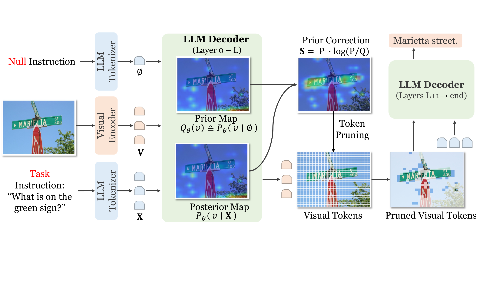
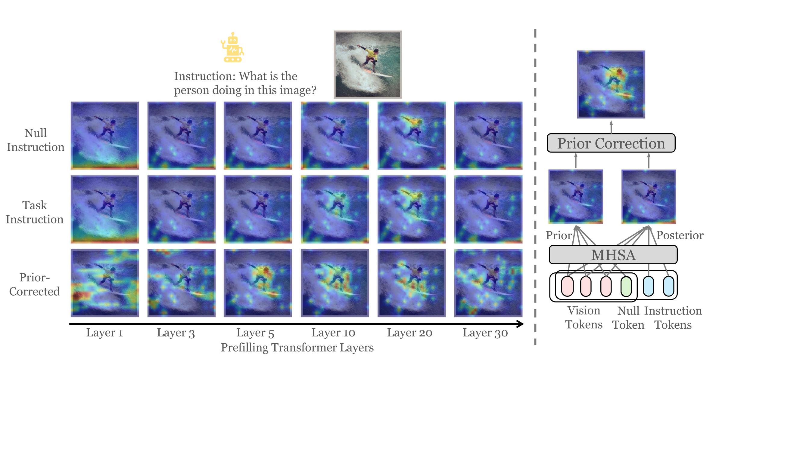
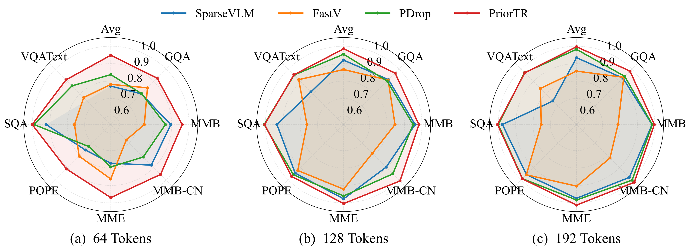

<div align="center">
<h1>[ECCV 2026] PriorTR: Accelerating Multimodal Large Language Models with Prior-Corrected Token Reduction</h1>
</div>

<p align="center">
  
</p>

<p align="center">
  Zengjie Chen<sup>1,2</sup>,
  Yuxiang Cai<sup>1,2,*</sup>,
  Jingcai Guo<sup>3</sup>,
  Taotao Cai<sup>4</sup>,
  Jianwei Yin<sup>1,2</sup>,
  Zhi Chen<sup>4,*</sup>
</p>

<p align="center">
  <sup>1</sup>School of Software Technology, Zhejiang University &nbsp;
  <sup>2</sup>Zhejiang Key Lab of Digital-Intelligence Service Technology<br>
  <sup>3</sup>The Hong Kong Polytechnic University &nbsp;
  <sup>4</sup>The University of Southern Queensland<br>
  <sup>*</sup>Corresponding authors
</p>

<p align="center">
  <a href="#"></a>
  <a href="https://github.com/CodeChildCZJ/PriorTR"></a>
  <a href="LICENSE"></a>
</p>

> **TL;DR** — Attention-based visual token pruning is dominated by a **model-induced prior**: an MLLM
> attends to certain regions even with no instruction. PriorTR corrects this by contrasting the
> task-conditioned attention `P` with an instruction-agnostic prior `Q` (estimated from a null token
> within a **single** forward pass) and ranks tokens by V-Information `S = P · log(P / Q)`. It is
> **training-free** and works across image and video MLLMs.

## 📜 News

- **[2026-06-20]** 🎉 Code released — PriorTR across LLaVA-1.5, InternVL2.5, Qwen3-VL, and Video-LLaVA, with a unified runner.
- **[2026-06-18]** 🎉 PriorTR is accepted to **ECCV 2026**!
- **[coming soon]** 📄 arXiv preprint.

## 📖 Introduction

Visual token reduction accelerates Multimodal Large Language Models (MLLMs) by pruning redundant image
tokens at an early decoder layer. Most methods rank tokens by raw text–visual attention, but we show
this ranking is confounded by a **model-induced prior** — even without any textual instruction, the
model focuses on certain task-agnostic regions, which suppresses the attention of genuinely
instruction-relevant tokens and raises the risk that they are discarded.

**PriorTR** (Prior-Corrected Token Reduction) explicitly separates task-conditioned attention from this
prior. It introduces a **null token** (e.g., the separator `\n`) that, under the causal mask, cannot
see the instruction and therefore serves as an instruction-agnostic probe — estimating the prior `Q`
and the task posterior `P` *within the same attention block*, with **no duplicated forward pass**. Each
visual token is scored by its V-usable information contribution `S = P · log(P / Q)`, and the top-K
tokens are **physically retained** so every subsequent layer operates on a shortened visual sequence.

<p align="center">
  
</p>

## 💡 Highlights

- 🔥 **Training-free & plug-in.** No fine-tuning and no extra parameters — drop PriorTR into a frozen MLLM.
- 🔥 **A hidden prior in attention.** We identify that attention-based ranking is dominated by a *model-induced prior* that buries instruction-relevant tokens.
- 🔥 **Prior correction in a single forward.** A null token probes the prior `Q` and the posterior `P` in the *same* attention block — avoiding the duplicated propagation that two-pass methods need.
- 🔥 **V-Information scoring.** Tokens are ranked by `S = P · log(P / Q)`, the additional task-usable information each token carries, rather than by raw attention magnitude.
- 🔥 **Image *and* video, 4 backbones.** One unified implementation across LLaVA-1.5, InternVL2.5, Qwen3-VL (image) and Video-LLaVA (video), behind a single CLI.
- 🔥 **State-of-the-art trade-off.** Keeps **~99.5%** of full performance at **1/3** the tokens and **94.5%** at **1/9**, beating strong training-free baselines — the gap widens under aggressive budgets.

## 📊 Results

Average performance across **12 benchmarks** on **LLaVA-1.5-7B** (normalized to the 576-token upper
bound). PriorTR consistently leads, with the largest margin under tight token budgets.

| Visual tokens | Reduction | FastV | SparseVLM | VisPruner | **PriorTR (Ours)** |
|:---:|:---:|:---:|:---:|:---:|:---:|
| 576 (full) | – | – | – | – | 100.0 |
| 192 | ↓ 66.7% | 89.8 | 97.4 | 98.5 | **99.5** |
| 128 | ↓ 77.8% | 85.1 | 91.2 | 96.6 | **98.2** |
| 64 | ↓ 88.9% | 70.7 | 81.4 | 91.7 | **94.5** |

<p align="center">
  
</p>

PriorTR covers the largest area across benchmarks at every budget. See the
[paper](#) for full per-benchmark tables, video results, and ablations.

## 🗂️ Supported Models

| Model | Path | Conda Env | `transformers` | Strategies |
|---|---|---|---|---|
| LLaVA-1.5 | [`image/LLaVA/`](image/LLaVA/) | `PriorTRllava` | `4.37.2` | PriorTR |
| InternVL2.5 | [`image/InternVL/`](image/InternVL/) | `PriorTRinternvl` | `≤4.49.0` | PriorTR, FastV |
| Qwen3-VL | [`image/Qwen3-VL/`](image/Qwen3-VL/) | `PriorTRqwen3vl` | `5.2.0.dev0` (pinned commit) | PriorTR, PriorTR-2F, FastV, SparseVLM, VisPruner |
| Video-LLaVA | [`video/Video-LLaVA/`](video/Video-LLaVA/) | `PriorTRvideollava` | `4.37.2` | PriorTR-2F, FastV |

Each subproject pins a **mutually-incompatible** `transformers` version, so every model lives in its
**own conda env** — they cannot coexist in one Python process. **PriorTR-2F** is the two-forward variant
of PriorTR (an explicit prior forward instead of the single-forward causal-mask shortcut); Video-LLaVA
has no single-forward PriorTR because video lacks that shortcut.

## ⚙️ Installation

There is **no single environment** — build one conda env per model you want to run, because the
`transformers` pins are incompatible. Follow each subproject's README for exact, copy-pasteable commands;
the shape is the same everywhere:

```bash
conda create -n PriorTR<model> python=3.10 -y          # name must match the table above
conda activate PriorTR<model>
pip install torch torchvision --index-url .../cu128     # cu128 for Blackwell/SM_120, else cu121
pip install <pinned transformers>                       # per model: see the table / subproject README
pip install -e .                                        # Qwen3-VL uses `python setup.py develop` (creates a symlink)
```

The **image** models also evaluate through [lmms-eval](https://github.com/EvolvingLMMs-Lab/lmms-eval)
(clone it, `pip install -e . --no-deps` to keep the pinned `transformers`, then copy in the model
wrapper) — see the per-model README. **Video-LLaVA** ships its own inference scripts and does not use
lmms-eval. Weights and benchmark data download from HuggingFace on first run.

→ Per-model setup: [LLaVA](image/LLaVA/README.md) · [InternVL](image/InternVL/README.md) · [Qwen3-VL](image/Qwen3-VL/README.md) · [Video-LLaVA](video/Video-LLaVA/README.md)

> **Reproducibility:** each image subproject ships a locked `environment.yml` (`conda env export`). It
> pins every transitive version but is a **record, not a one-command rebuild** — `torch` (cu128 index),
> `transformers` (git/pinned), and the editable `lmms-eval` are off default channels, so install those
> per the README first; the `.yml` then pins the rest.

## 🚀 Unified Runner

Once the env(s) exist, [`vtr_run.py`](vtr_run.py) is a single CLI for **any model × method**. It does not
load models itself — it builds the right command and dispatches it into the matching conda env
(`conda run -n <env>`). Full capability matrix, per-method hyperparameters, and flags are in
[`docs/RUNNER.md`](docs/RUNNER.md).

```bash
python vtr_run.py --list                       # capability matrix; marks each env ✓ present / ✗ missing

# PriorTR on Qwen3-VL (image), keep 2/9 of the tokens
python vtr_run.py --model qwen3vl --method priortr --tasks mme --keep-ratio 0.2222 --gpus 0

# PriorTR-2F on Video-LLaVA (video: a dataset instead of --tasks)
python vtr_run.py --model video-llava --method priortr_2f \
    --video-dir /data/MSVD/videos --gt-question /data/MSVD/test_q.json \
    --gt-answers /data/MSVD/test_a.json --keep-tokens 64 --num-samples 500 --gpus 0
```

The runner translates unified flags into each subproject's own argument names. If your envs are named
differently, point it at them with `--env <name>` or an `envs.json` map — no code edits. Prefer the
per-subproject README commands directly? Those still work; the runner is just a uniform front-end.

> **Adding your own method?** The VTR framework is a plug-in strategy pattern — implement one
> `compute_scores` class and register it, no model-code changes. See
> [`docs/adding-a-method.md`](docs/adding-a-method.md) for the recipe (plus multi-layer pruning,
> per-layer strategies, and cross-layer caching).

## 📜 Citation

If you find PriorTR useful, please consider giving the repo a ⭐ and citing:

```bibtex
@inproceedings{chen2026priortr,
    title     = {Accelerating Multimodal Large Language Models with Prior-Corrected Token Reduction},
    author    = {Zengjie Chen and Yuxiang Cai and Jingcai Guo and Taotao Cai and Jianwei Yin and Zhi Chen},
    booktitle = {European Conference on Computer Vision (ECCV)},
    year      = {2026}
}
```

## ❤️ Acknowledgments

Built on the open-source MLLMs [LLaVA](https://github.com/haotian-liu/LLaVA),
[InternVL](https://github.com/OpenGVLab/InternVL),
[Qwen3-VL](https://github.com/QwenLM/Qwen3-VL), and
[Video-LLaVA](https://github.com/PKU-YuanGroup/Video-LLaVA); evaluated with
[lmms-eval](https://github.com/EvolvingLMMs-Lab/lmms-eval). We also reuse the public implementations of
the baselines we compare against — [FastV](https://github.com/pkunlp-icler/FastV),
[SparseVLM](https://github.com/Gumpest/SparseVLMs), and
[VisPruner](https://github.com/Theia-4869/VisPruner).

## License

This repository builds on multiple open-source projects; each subproject retains the license of its base model:

| Subproject | Base Model License |
|---|---|
| LLaVA | Apache 2.0 |
| InternVL | MIT |
| Qwen3-VL | Apache 2.0 |
| Video-LLaVA | Apache 2.0 |

The PriorTR-specific code (VTR framework, strategies, model wrappers) is released under the
[Apache 2.0 License](LICENSE).
